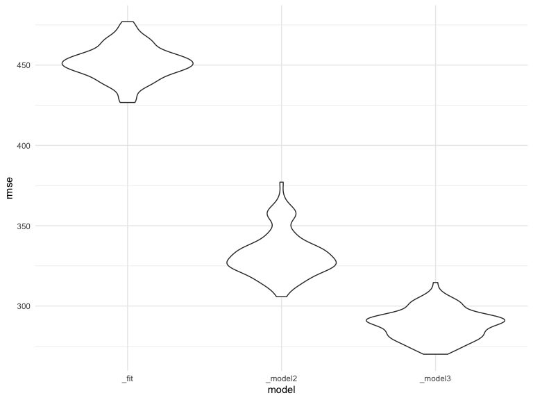
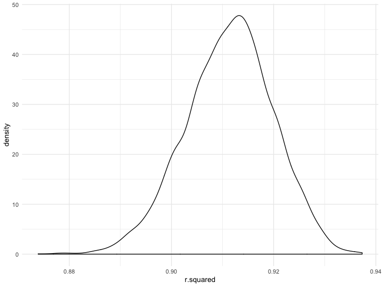
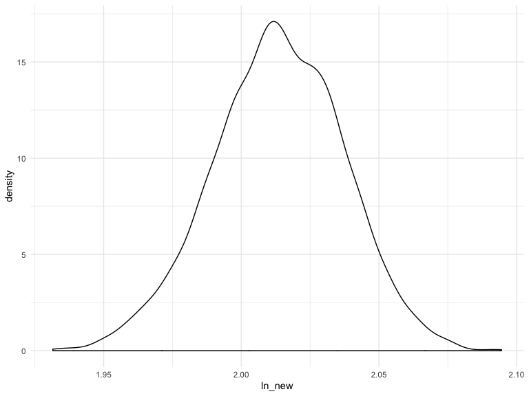

Homework 6
================
LML
Nov 25 by 4:00pm

Setup

``` r
library(tidyverse)
```

    ## ── Attaching packages ───────────────────────────────────────────────────────────────────────────── tidyverse 1.2.1 ──

    ## ✔ ggplot2 3.2.1     ✔ purrr   0.3.2
    ## ✔ tibble  2.1.3     ✔ dplyr   0.8.3
    ## ✔ tidyr   1.0.0     ✔ stringr 1.4.0
    ## ✔ readr   1.3.1     ✔ forcats 0.4.0

    ## ── Conflicts ──────────────────────────────────────────────────────────────────────────────── tidyverse_conflicts() ──
    ## ✖ dplyr::filter() masks stats::filter()
    ## ✖ dplyr::lag()    masks stats::lag()

``` r
library(modelr)
knitr::opts_chunk$set(
    echo = TRUE,
    warning = FALSE,
    fig.width = 8, 
  fig.height = 6,
  out.width = "90%"
)
options(
  ggplot2.continuous.colour = "viridis",
  ggplot2.continuous.fill = "viridis"
)
scale_colour_discrete = scale_colour_viridis_d
scale_fill_discrete = scale_fill_viridis_d
theme_set(theme_minimal() + theme(legend.position = "bottom"))
set.seed(1)
```

Problem 1
=========

In the following chunck I load and tidy the dataset, creating factor variables for the categorical variables. I also quickly overview the data and check for missing data (there are none).

``` r
child_data = 
  readr::read_csv("data/birthweight.csv") %>%
  janitor::clean_names() %>%
    mutate(
    babysex = factor(babysex, labels = c("male", "female")),
    frace = factor(frace, levels = c(1, 2, 3, 4, 8, 9), labels = c("White", "Black", "Asian"," Puerto Rican", "Other", "Unknown")),
    malform = factor(malform, labels = c("absent", "present")),
    mrace = factor(mrace,  c(1, 2, 3, 4, 8, 9), labels = c("White", "Black", "Asian"," Puerto Rican", "Other", "Unknown"))
    )
```

    ## Parsed with column specification:
    ## cols(
    ##   .default = col_double()
    ## )

    ## See spec(...) for full column specifications.

``` r
# quick overview
summary(child_data)
```

    ##    babysex         bhead          blength           bwt      
    ##  male  :2230   Min.   :21.00   Min.   :20.00   Min.   : 595  
    ##  female:2112   1st Qu.:33.00   1st Qu.:48.00   1st Qu.:2807  
    ##                Median :34.00   Median :50.00   Median :3132  
    ##                Mean   :33.65   Mean   :49.75   Mean   :3114  
    ##                3rd Qu.:35.00   3rd Qu.:51.00   3rd Qu.:3459  
    ##                Max.   :41.00   Max.   :63.00   Max.   :4791  
    ##      delwt          fincome                frace         gaweeks     
    ##  Min.   : 86.0   Min.   : 0.00   White        :2123   Min.   :17.70  
    ##  1st Qu.:131.0   1st Qu.:25.00   Black        :1911   1st Qu.:38.30  
    ##  Median :143.0   Median :35.00   Asian        :  46   Median :39.90  
    ##  Mean   :145.6   Mean   :44.11    Puerto Rican: 248   Mean   :39.43  
    ##  3rd Qu.:157.0   3rd Qu.:65.00   Other        :  14   3rd Qu.:41.10  
    ##  Max.   :334.0   Max.   :96.00   Unknown      :   0   Max.   :51.30  
    ##     malform        menarche        mheight          momage    
    ##  absent :4327   Min.   : 0.00   Min.   :48.00   Min.   :12.0  
    ##  present:  15   1st Qu.:12.00   1st Qu.:62.00   1st Qu.:18.0  
    ##                 Median :12.00   Median :63.00   Median :20.0  
    ##                 Mean   :12.51   Mean   :63.49   Mean   :20.3  
    ##                 3rd Qu.:13.00   3rd Qu.:65.00   3rd Qu.:22.0  
    ##                 Max.   :19.00   Max.   :77.00   Max.   :44.0  
    ##            mrace          parity            pnumlbw     pnumsga 
    ##  White        :2147   Min.   :0.000000   Min.   :0   Min.   :0  
    ##  Black        :1909   1st Qu.:0.000000   1st Qu.:0   1st Qu.:0  
    ##  Asian        :  43   Median :0.000000   Median :0   Median :0  
    ##   Puerto Rican: 243   Mean   :0.002303   Mean   :0   Mean   :0  
    ##  Other        :   0   3rd Qu.:0.000000   3rd Qu.:0   3rd Qu.:0  
    ##  Unknown      :   0   Max.   :6.000000   Max.   :0   Max.   :0  
    ##      ppbmi            ppwt           smoken           wtgain      
    ##  Min.   :13.07   Min.   : 70.0   Min.   : 0.000   Min.   :-46.00  
    ##  1st Qu.:19.53   1st Qu.:110.0   1st Qu.: 0.000   1st Qu.: 15.00  
    ##  Median :21.03   Median :120.0   Median : 0.000   Median : 22.00  
    ##  Mean   :21.57   Mean   :123.5   Mean   : 4.145   Mean   : 22.08  
    ##  3rd Qu.:22.91   3rd Qu.:134.0   3rd Qu.: 5.000   3rd Qu.: 28.00  
    ##  Max.   :46.10   Max.   :287.0   Max.   :60.000   Max.   : 89.00

``` r
# check for missings (no missings)
sum(complete.cases(child_data))
```

    ## [1] 4342

``` r
sum(!complete.cases(child_data))
```

    ## [1] 0

For my model, I did a quick topical overview and chose the variables that seemed most influential in affecting a baby's birthweight.

``` r
fit =
  lm(bwt ~ gaweeks + mrace + malform + pnumlbw + ppbmi, data = child_data) 
```

The following is a plot of residuals against fitted values from my model.

``` r
# why does it say r squared is missing?
child_data %>%
  add_residuals(fit) %>%
  add_predictions(fit) %>%
  ggplot(aes(x = pred, y = resid)) + 
  geom_point()  + 
  geom_smooth(se = FALSE) + 
  labs(title = "Predicted vs residuals", 
       x = "Predicted", 
       y = "Residuals")
```

    ## `geom_smooth()` using method = 'gam' and formula 'y ~ s(x, bs = "cs")'


In the following chunk I build two models to compare to the model that I built.

``` r
# One using length at birth and gestational age as predictors (main effects only)
model2 = lm(bwt ~ blength + gaweeks, data = child_data) %>%
  broom::glance()

#One using head circumference, length, sex, and all interactions (including the three-way interaction) between these
model3 = lm(bwt ~bhead*blength + bhead*babysex + blength*babysex + bhead*blength*babysex , data = child_data) %>%
  broom::glance()
```

The following chunk uses cross-validation to comparer the predictive performance of the three models.

``` r
# get cross validation train/test sets
cv_child_data = 
  crossv_mc(child_data, 100) 

# make cv data into tibbles
cv_child_data =
  cv_child_data %>% 
  mutate(train = map(train, as_tibble),
         test = map(test, as_tibble))
```

``` r
# fit my candidate models above and assess prediction accuracy
cv_child_data =
  cv_child_data %>% 
  mutate(
    fit = map(train, ~lm(bwt ~ gaweeks + mrace + malform + pnumlbw + ppbmi, data = .x)),
    model2  = map(train, ~lm(bwt ~ blength + gaweeks, data = .x)),
    model3  = map(train, ~lm(bwt ~ bhead*blength + bhead*babysex + blength*babysex + bhead*blength*babysex, data = .x))
    ) %>%
      mutate(
        rmse_fit = map2_dbl(fit, test, ~rmse(model = .x, data = .y)),
        rmse_model2 = map2_dbl(model2, test, ~rmse(model = .x, data = .y)),
        rmse_model3 = map2_dbl(model3, test, ~rmse(model = .x, data = .y))
        )
```

``` r
# plot below shows the distribution of RMSE values for each candidate model
cv_child_data %>% 
  select(starts_with("rmse")) %>% 
  pivot_longer(
    everything(),
    names_to = "model", 
    values_to = "rmse",
    names_prefix = "rmse") %>% 
  mutate(model = fct_inorder(model)) %>% 
  ggplot(aes(x = model, y = rmse)) + geom_violin()
```



Problem 2
=========

``` r
set.seed(1)

weather_df = 
  rnoaa::meteo_pull_monitors(
    c("USW00094728"),
    var = c("PRCP", "TMIN", "TMAX"), 
    date_min = "2017-01-01",
    date_max = "2017-12-31") %>%
  mutate(
    name = recode(id, USW00094728 = "CentralPark_NY"),
    tmin = tmin / 10,
    tmax = tmax / 10) %>%
  select(name, id, everything())
```

    ## Registered S3 method overwritten by 'crul':
    ##   method                 from
    ##   as.character.form_file httr

    ## Registered S3 method overwritten by 'hoardr':
    ##   method           from
    ##   print.cache_info httr

    ## file path:          /Users/joanlynch/Library/Caches/rnoaa/ghcnd/USW00094728.dly

    ## file last updated:  2019-09-10 11:55:57

    ## file min/max dates: 1869-01-01 / 2019-09-30

``` r
r_squared =
# Produce estimates and plot r̂ 2
  weather_df %>% 
  # Get 5000 bootstrap samples
  modelr::bootstrap(n = 5000) %>% 
  mutate(
    # simple linear model
    models = map(strap, ~lm(tmax ~ tmin, data = .x)),
    results = map(models, broom::glance)) %>%
    select(-strap, -models) %>% 
      unnest(results) 

r_squared %>% ggplot(aes(x = r.squared)) + geom_density()
```



``` r
ln_new_plot= 
# plot  log(β̂ 0∗β)
  weather_df %>% 
  # Get 5000 bootstrap samples
  modelr::bootstrap(n = 5000) %>% 
  mutate(
    # simple linear model
    models = map(strap, ~lm(tmax ~ tmin, data = .x)),
    results = map(models, broom::tidy)) %>%
    select(-strap, -models) %>% 
    unnest(results) %>%
    select(-std.error, -statistic, -p.value) %>% 
    pivot_wider(
    names_from = term, values_from = estimate) %>%
    rename(beta_0 = "(Intercept)") %>%
    mutate(ln_new = log(tmin*beta_0)
         ) 

ln_new_plot %>%
  ggplot(aes(x = ln_new)) + geom_density()
```



``` r
# CI's
r2r_CI = quantile(r_squared$r.squared, prob = c(0.025, 0.975)) 
r2r_CI
```

    ##      2.5%     97.5% 
    ## 0.8936684 0.9271060

``` r
log_CI = quantile(ln_new_plot$ln_new, prob = c(0.025, 0.975)) 
log_CI
```

    ##     2.5%    97.5% 
    ## 1.964811 2.058645
